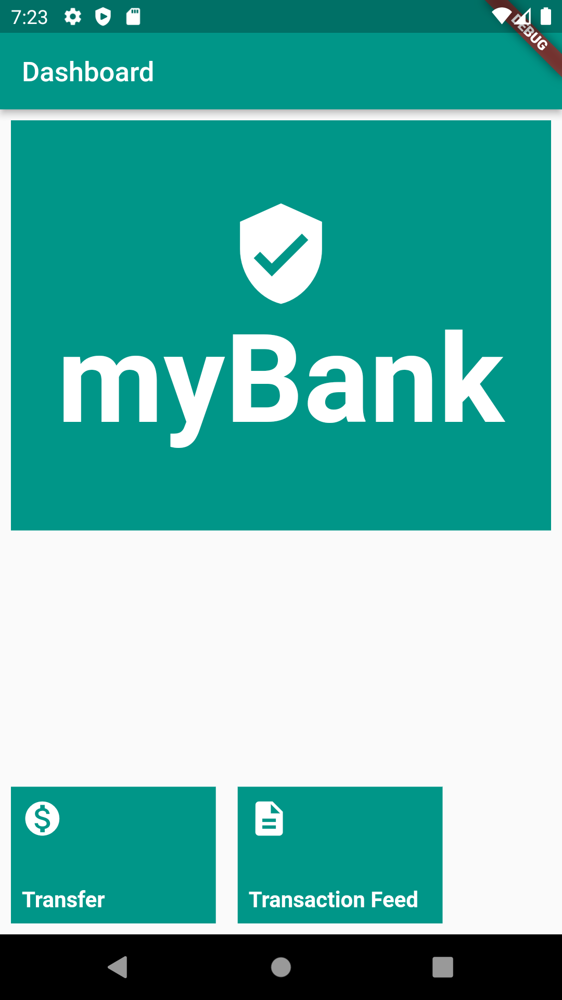
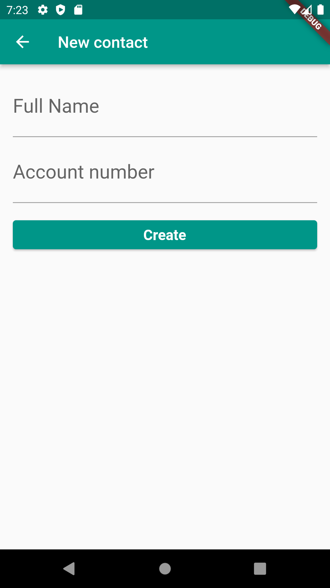

# Flutter com web API

> **obs1.:** Para uso do webApi de exemplo, vá a pasta **WebApiStudies** e no arquivo README tem toda a descrição de utilização.
> 
> **obs2.:** Senha padrão para transferências é o valor 1000. 
> 
> **obs3.:** Alterar a url do `webclient.dart` para o seu ip local `const String baseUrl = 'http://<IP DA SUA MAQUINA AQUI>:8080/transactions';`

## Objetivos ao completar os estudos
- Implemente callbacks personalizados
- Consuma uma web api com o package do http
- Configure interceptadores
- Aprenda a converter json no Dart
- Lide com problemas de comunicação
- Envie dados para web api
- Refatore o código de comunicação externa

## Ementas:

### Ajustando o Dashboard
- Orientações iniciais e organização do curso
- Baixando o projeto inicial
- Novidades
- Novas funcionalidades no Dashboard
- Adicionando novas features
- Delegando eventos com callbacks
- Utilizando callbacks nas funcionalidades
- Adicionando a lista de transferências
- Implementando a tela de transferências
- Para saber mais - Validando argumentos do construtor com assert
- O que aprendi?
    - A utilizar o row para estruturar Widgets no modo horizontal;
    - Como utilizar funções de callback para delegar comportamentos de eventos;
    - Como indicar que o argumento é obrigatório mesmo sendo opcional.

### Realizando comunicação http
- Configurando o ambiente da web api
- Executando a web api
- Para saber mais – Conteúdos sobre web api e http
- Buscando transferências da web api
- Configurando o pacote http
- Utilizando o interceptador do http
- Configurando o logging interceptor
- Para saber mais – Acessando a web API local via endereço público
- O que aprendi?
    - Executar uma web API do Spring Boot;
    - Testar a web API com o Postman;
    - Configurar e usar o package http do Dart;
    - Realizar uma requisição GET do http no Flutter.

### Apresentando dados da web api na tela do App
- Convertendo json para objeto do Dart
- Convertendo json para objeto
- Carregando a lista de transferências na tela
- Exibindo as transferências no App
- Lidando com problemas da comunicação externa
- Evitando problemas com a web api
- Para saber mais – Outros problemas comuns com comunicação HTTP
- O que aprendi?
    - Converter json para objeto do Dart;
    - Apresentar dados da web api com o FutureBuilder;
    - Exibir um feedback adequado para situações excepcionais.

### Enviando transferência para Web API
- Salvando transferências
- Enviando transferência na web api
- Integrando a inserção de transferências
- Salvando transferência pelo formulário
- Para saber mais – Outros comportamentos do HTTP
- O que aprendi?
    - Implementar a requisição post para o HTTP;
    - Salvar uma transferência na web api;
    - Converter objeto Dart para JSON.

### Melhorando o webclient
- Organizando o código do web client
- Serializando JSON no objeto
- Implementando métodos de conversão
- Para saber mais – Serialização com código gerado
- Simplificando o código de conversão
- Utilizando o map para conversão
- Conclusão
- Projeto final
- O que aprendi?
    - Organizar o código do web client;
    - Simplificar a conversão entre objetos e JSON;
    - Utilizar a função map() para converter uma lista.

***

## Flutter project screens - myBank App

